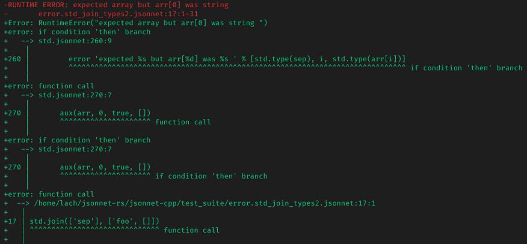

# jrsonnet

## What is it

[Jsonnet](https://jsonnet.org/) is a json templating language

This crate implements both jsonnet library, and alternative jsonnet executable

## Why

There is already 3 implementations of this standard: in [C++](https://github.com/google/jsonnet), in [Go](https://github.com/google/go-jsonnet/) and in [Scala](https://github.com/databricks/sjsonnet)

It is fun to write one in Rust :D

## Spec support

- Can pass all of original `examples` tests
- Can pass all of original `test_suite` tests, expect those, which checks golden output for stacktraces (vanilla-like stacktraces are implemented, but look is not 100% identical): 

## Bindings

C bindings (libjsonnet.so) are WIP
JS bindings are WIP too, but also available in WASM form

See them in `./bindings/jsonnet/`

## Benchmark

It is faster than golang implementation on mine kubernetes cluster configuration, which includes a lot of stuff, i.e prometheus operator

Mine configuration contains two manifests, first one contains a lot of plain values, second one - a lot of computations

- `gojsonnet` - golang impl
- `../../../../jsonnet-rs/target/release/jrsonnet` - this repo impl

```markdown
# Manifest 1 (plain values)

Benchmark #1: gojsonnet 02-prepare.jsonnet -J ../vendor/
  Time (mean ± σ):     647.4 ms ±  12.8 ms    [User: 1.252 s, System: 0.069 s]
  Range (min … max):   626.0 ms … 668.7 ms    10 runs

Benchmark #2: ../../../../jsonnet-rs/target/release/jrsonnet 02-prepare.jsonnet -J ../vendor/
  Time (mean ± σ):     163.7 ms ±   2.9 ms    [User: 138.5 ms, System: 24.6 ms]
  Range (min … max):   161.4 ms … 174.0 ms    17 runs

Summary
  '../../../../jsonnet-rs/target/release/jrsonnet 02-prepare.jsonnet -J ../vendor/' ran
    3.96 ± 0.10 times faster than 'gojsonnet 02-prepare.jsonnet -J ../vendor/'

# Manifest 2 (computations)

Benchmark #1: gojsonnet 03-deploy.jsonnet -J ../vendor/
  Time (mean ± σ):     14.387 s ±  0.473 s    [User: 27.657 s, System: 0.226 s]
  Range (min … max):   13.865 s … 15.147 s    10 runs

Benchmark #2: ../../../../jsonnet-rs/target/release/jrsonnet 03-deploy.jsonnet -J ../vendor/
  Time (mean ± σ):      2.373 s ±  0.083 s    [User: 2.304 s, System: 0.063 s]
  Range (min … max):    2.286 s …  2.486 s    10 runs

Summary
  '../../../../jsonnet-rs/target/release/jrsonnet 03-deploy.jsonnet -J ../vendor/' ran
    6.06 ± 0.29 times faster than 'gojsonnet 03-deploy.jsonnet -J ../vendor/'
```

However, go impl still can be faster in some cases, because it curretly have more stdlib functions implemented in native, instead of stdlib (I.e `std.base64`)
